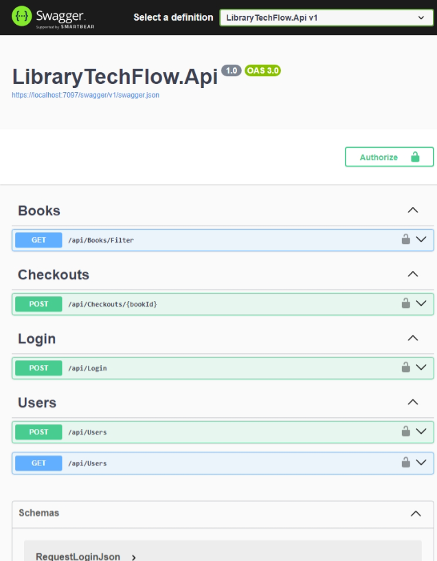

# LibraryTechFlow

O **LibraryTechFlow** é uma API RESTful desenvolvida em C# com ASP.NET Core, projetada para gerenciar uma biblioteca de livros, usuários e empréstimos.

A aplicação enfatiza práticas modernas de desenvolvimento, incluindo autenticação JWT, paginação, casos de uso bem definidos e injeção de dependências, seguindo as melhores práticas e convenções do desenvolvimento de APIs.

## 💻 Descrição

Este sistema facilita o gerenciamento de livros, usuários e processos de empréstimo em uma biblioteca.
Além das operações CRUD tradicionais, a aplicação implementa autenticação segura com JWT e utiliza a biblioteca BCrypt para hashing de senhas, garantindo a segurança dos dados dos usuários.

<p align="center">
<kbd>
  
</kbd>
</p>

## 🔮 Funcionalidades

- **Autenticação JWT**: Implementa autenticação baseada em tokens JWT para proteger endpoints e gerenciar sessões de usuários.
- **Gerenciamento de Livros**: Permite criar, listar, atualizar e remover livros do acervo.
- **Gerenciamento de Usuários**: Facilita o cadastro, atualização e remoção de usuários, com armazenamento seguro de senhas utilizando BCrypt.
- **Gerenciamento de Empréstimos**: Controla o processo de empréstimo e devolução de livros, incluindo datas previstas e efetivas de retorno.
- **Paginação**: Oferece suporte a paginação em listagens para melhorar a performance e a experiência do usuário.

## 📊 Estrutura das Entidades

### Book (Livro)

- **Atributos**: `Id`, `Title`, `Author`, `Amount`
- **Descrição**: Representa um livro disponível na biblioteca, incluindo título, autor e quantidade em estoque.

### User (Usuário)

- **Atributos**: `Id`, `Name`, `Email`, `Password`
- **Descrição**: Representa um usuário do sistema, com informações pessoais e credenciais de acesso.

### Checkout (Empréstimo)

- **Atributos**: `Id`, `CheckoutDate`, `UserId`, `BookId`, `ExpectedReturnDate`, `ReturnedDate`
- **Descrição**: Registra o empréstimo de um livro por um usuário, incluindo datas de empréstimo e devolução.

## 🛠️ Tecnologias Utilizadas

- **C# .NET Core**
- **ASP.NET Core**
- **Entity Framework Core**
- **BCrypt.Net**: Utilizado para hashing seguro de senhas.
- **JWT (JSON Web Tokens)**: Para autenticação e autorização baseada em tokens.

## ✨ Padrões de Projeto e Melhores Práticas

- **Injeção de Dependência**: Facilita o gerenciamento e a inversão de controle das dependências, promovendo um código mais modular e testável.
- **Casos de Uso (Use Cases)**: Organiza a lógica de negócios em classes específicas, seguindo o princípio da responsabilidade única do SOLID e facilitando a manutenção.
- **Paginação**: Implementada para otimizar a performance em consultas que retornam grandes volumes de dados.
- **Hashing de Senhas com BCrypt**: Garante que as senhas dos usuários sejam armazenadas de forma segura, protegendo contra ataques de força bruta e rainbow tables. O BCrypt é preferido por sua capacidade de adaptação à crescente capacidade computacional, permitindo ajustar o fator de trabalho conforme necessário.

## 📂 Estrutura do Projeto

O projeto é dividido em diferentes camadas, cada uma com uma responsabilidade específica, seguindo os princípios de separação de preocupações:

- **LibraryTechFlow.Api**: Contém os controladores e configurações da API, gerenciando as requisições HTTP e as respostas correspondentes.
- **LibraryTechFlow.Communication**: Define os contratos de comunicação de Requests e Responses, facilitando a transferência de dados entre as camadas.
- **LibraryTechFlow.Domain**: Inclui as entidades de domínio, representando o núcleo da lógica de negócios.
- **LibraryTechFlow.Exception**: Gerencia as exceções personalizadas e o tratamento de erros, garantindo respostas adequadas e consistentes para os clientes da API.
- **LibraryTechFlow.Security**: Responsável pela configuração e implementação de segurança, incluindo a geração e validação de tokens JWT e o hashing de senhas com BCrypt.

Essa divisão em camadas promove uma arquitetura limpa e organizada, facilitando a manutenção, escalabilidade e testabilidade da aplicação.

## 🚀 Configuração do Ambiente

1. **Clone o repositório:**

   ```bash
   git clone https://github.com/Brendon3578/LibraryTechFlow.git
   ```

2. **Navegue até o diretório do projeto:**

   ```bash
   cd LibraryTechFlow
   ```

3. **Restaure as dependências:**

   ```bash
   dotnet restore
   ```

4. **Configure o arquivo `appsettings.json` para definir as configurações do banco de dados e do JWT:**

### 🔧 Configuração do `appsettings.json`

No arquivo `appsettings.json`, você pode alterar as configurações conforme necessário:

```json
{
  "ConnectionStrings": {
    "SqlLiteDatabase": "Data Source=caminho_do_banco.sqlite"
  },
  "JwtSettings": {
    "Secret": "sua_chave_secreta_para_jwt"
  },
  "Logging": {
    "LogLevel": {
      "Default": "Information",
      "Microsoft.AspNetCore": "Warning"
    }
  },
  "AllowedHosts": "*"
}
```

- **`SqlLiteDatabase`**: Especifique o caminho do banco de dados SQLite utilizado pela aplicação.
- **`JwtSettings.Secret`**: Defina um segredo seguro para a assinatura dos tokens JWT.

5. **Inicie a aplicação:**

   ```bash
   dotnet run
   ```

A API estará disponível em `https://localhost:7097` ou conforme configurado, e para acessar o swagger acesse
`https://localhost:7097/swagger/index.html`.

---

Feito com ☕ por [Brendon Gomes](https://github.com/Brendon3578)
